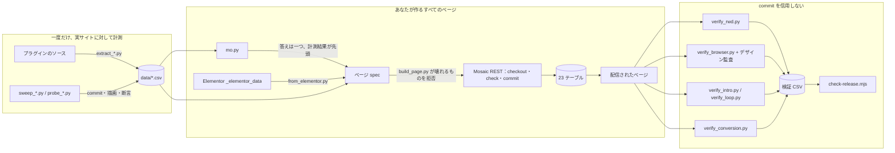

# mosaic-headless

[](https://www.npmjs.com/package/mosaic-headless)

[Mosaic Pro](https://mosaicbuilder.com)（Nextend）のサイトを、データモデルを直接書いて
構築・変更する — ビジュアルエディタも DOM も使わない。Elementor のページを取り込む。
テーマをまるごと別のインストールへ移す。すべての主張は実際のサイトで計測済み。

*他の言語：[English](README.md) · [繁體中文](README.zh-TW.md) · [한국어](README.ko.md)*

---

## インストール

```bash
npx mosaic-headless                          # 対話式：プラットフォームを選ぶ
npx mosaic-headless claude-code --global     # Claude Code、~/.claude/skills/ へ
npx mosaic-headless cursor --to ./my-project
npx mosaic-headless --list                   # 対応 8 プラットフォーム
```

| プラットフォーム | 何が入るか | どこに |
|---|---|---|
| Claude Code | スキル一式：SKILL.md + references/ + tools/ + data/ + sites/ | `~/.claude/skills/` または `./.claude/skills/` |
| Codex CLI | スキル一式 | `~/.codex/` |
| Gemini CLI | スキル一式 | `~/.gemini/` |
| GitHub Copilot | スキル一式に加え、`copilot-instructions.md` へ追記 | `./.github/` |
| Cursor | references を埋め込んだ `.mdc` ルール 1 本 | `~/.cursor/rules/` |
| Windsurf | references を埋め込んだルールファイル 1 本 | `./.devin/` |
| Continue | references を埋め込んだルールファイル 1 本 | `~/.continue/` |
| Claude.ai | プロジェクトスキルとしてアップロードする zip | 保存した場所 |

各プラットフォームのインストールはリリースゲートがテンプレートに対して検証する。ツールの
実行には Python 3 と Playwright が必要。ルールファイル型のプラットフォームには知識だけが
入り、ツールは入らない。

**更新は自動では起きない。** npm に新版が出ても、エージェントが読み込むフォルダは変わらない。
インストーラを `--force` 付きで再実行する（付けないと、手を入れた可能性のある SKILL.md の
上書きを拒否する）：

```bash
npx mosaic-headless@latest claude-code --global --force
```


## これは何か

Mosaic はページを **23 個のカスタムテーブル**に保持する。`post_content` でもなければ
`postmeta` でもない。要素ひとつにつき 1 行、ツリー構造は `parentID` カラム、兄弟の順序は
fractional-index の文字列。エディタはこのモデルの一クライアントにすぎない。フォーマット
そのものではないし、なくても困らない。

このスキルはそのモデルの地図 — ソースを読んで得たものではなく、実際のインストールに対して
計測したもの — と、モデルを通して書き、出てきたものを検証し、Elementor からページを持ち込む
ためのツール群である。

## 部品のつながり



左から右へ：表は一度だけ計測して同梱される；すべてのページは表を通して書かれ、表が否と
言えば拒否される；配信されたページを読み戻し、結果がリリースゲートの見る表に記録される
までは何も信用しない。

## 唯一のルール

**ノード型、プロパティ名、列挙値、スタイルキー、Free/Pro の判断を記憶から書かない。
`data/` で引く。**

しかも grep ではなく `mo.py` で引く。grep は打った質問には答えるが、本当に抱えている質問には
答えない。`accordion-content` を grep すればその型が存在することは分かる。スイープ表は
BROKE_PAGE だと言う — 置けば公開ページ全体が 54 バイトのエラー文字列になる。どちらも本当で、
どちらも間違った答えだ。行の横の注記は、その文字列が「親がない」ことを名指ししていること、
`accordion > accordion-item` の下に入れ子にすれば commit も描画も通り、キーボードで操作できる
開閉 UI までついてくることを言っている。`mo.py type` はその三つを一度に見せる。

```bash
python tools/mo.py type accordion-content   # 1 つの型を、全ライブスイープに接続して表示
python tools/mo.py check div text button    # 安全でない／未知の型があれば 1 で終了
python tools/mo.py params text              # 1 つの型に設定できるすべて
python tools/mo.py style --grouped          # 単独では無効になる 20 個
python tools/mo.py states --verified        # コンパイルされることが計測済みの状態
python tools/mo.py css grid-column          # この CSS を出す Mosaic のキー
```

そのうえでページを見る。Mosaic には **8 つ**の失敗モードがあり、HTTP ステータスが変わるのは
そのうち 3 つだけ：

```
バリデータの正常な拒否       HTTP 200 + 本文に `exceptions` 配列
commit 中の PHP fatal        HTTP 500（122 型のうち 15 が plain div の下でこうなる）
構造的に不正なノード         HTTP 200、commit 済み、DB に行あり、そして公開ページ全体が
                             54 バイトのエラー文字列になる
値の「形」が違う             HTTP 200、保存済み、CSS ルールがただ出ない
ルールは正しく結果が違う     HTTP 200、スタイルシートにあり、正しく、ブラウザが別の値を計算する
URL にテンプレートがない     HTTP 406、未ログインには空の本文
内容による描画時 fatal       HTTP 500 — commit は通り、Mosaic がページを解析する時に死ぬ。
                             `code` ノードの内容はテンプレートで、minifier が書く `@media(` は
                             関数呼び出しとして読まれる。`@media (` なら描画される。
                             build_page は前者を拒否する。
プラグイン更新で出力が変わる HTTP 200、ページは無事、行も移行済み — だが出力クラスに対して
                             書いた CSS が何にも当たらない。1.0.8 は `M_EL4 M_EL_Div` を
                             `m-div _e` に、状態クラスも一緒に、`customStyles` を
                             `customDeclarations` に改名した。例のタップ拡大が開かなくなり、
                             それを言ったのは verify_loop.py だった。
```

commit の成功はページが動く証拠ではないし、正しいスタイルシートもそうではない。ここの
ツールはすべて書いた後にページを取得し、5xx を空ページとして扱う — WordPress の
「重大なエラー」画面は 2,697 バイトで、素朴な「健全なページ」の下限より大きいからだ。

## 何を、どう検証したか

すべて実際のインストールに対して実行 — WordPress 7.1、WooCommerce 11.1、Mosaic Pro 1.0.8、
**ライセンスなし**：ライセンスが制限するのはテーマライブラリと更新であってノードファクトリ
ではないので、Pro の型も登録・描画される。

| 項目 | 結果 |
|---|---|
| **ノード型** | 122 / 122 を 1 型 1 ドキュメントでスイープ、commit → 描画 → 断言 → 削除：70 RENDERED、25 COMMITTED、15 COMMIT_5xx、12 BROKE_PAGE。1.0.8 で再スイープ：以前は黙って commit されていた 5 型が、親なしではページを落とすようになった。描画されなかった行のうち 3 つは「必要な親なしで commit した」というスイープ手法の産物で、その旨が行の横にある |
| **スタイルプロパティ** | 98 / 98 を実ページに書き、コンパイル済み CSS と照合：58 COMPILED、18 ABSENT、21 SKIPPED |
| **ノードプロパティ** | 182 / 182 を各プロパティ自身のバリデータ連鎖から導いた値で再探査：35 APPLIED、43 NO_EFFECT、55 NO_HOST、47 SKIPPED |
| **レスポンシブ** | 2 サイト計 731 件の `_t`/`_m` 宣言を、サイトが実際に配信したスタイルシートに対して 1 件ずつ断言 — 全件検証済み |
| **ブラウザ** | 配信された 2 ページを Chromium の 3 つのビューポートで計算スタイル 3,988 件読み取り：2,929 件が一致、912 件は比較不能として明示、**上書き 0 件** |
| **デザイン監査** | コントラスト、フォントフォールバック、CJK の字送り、横溢れ、テキストの切れ、1 行の文字数 — ブラウザ上で実行、**指摘 26 件、すべて理由付きで裁定済み** — 理由のない容認はリリースゲートが拒否する |
| **コンポーネント** | コンポーネントシステムを端から端まで駆動、**8 件中 8 件**：カテゴリの下に作成、ドキュメントが自己修復、書き込み可能インスタンス経由でツリーを充填、読み取り専用インスタンスは同じ書き込みを拒否（ネガティブコントロール）、ページ上の 2 インスタンスが 1 つの定義を 2 度描画 |
| **スタイル状態** | 53 状態のうち 52 を実ページに書き、表が約束するセレクタと照合：**36 が完全一致**、13 NO_HOST、3 SKIPPED、0 BROKE_PAGE。擬似クラスは大文字で出力される（`.M_EL9:HOVER`） |
| **インタラクション** | JS アニメーション経路をネガティブコントロール付きで探査し行を読み戻し：`propertyMetas` **は**受理・保存される；プロパティ値は依然として結び付かず、その境界は正確になった |
| **アコーディオン** | `accordion-item` と `accordion-content` はスイープ表では BROKE_PAGE。ファクトリが要求する通りに入れ子にすれば commit も描画も通る、**7 件中 7 件** |
| **入場アニメーション** | 単調時計で 15 時点をサンプリングし 8 項目を断言。文書の初回レイアウトを待ってから始まるため、アニメーションの全くないページに対して遅れフレームは 1 つだけ |
| **常時アニメーション** | 隅で刷り続け、タップすると拡大する版 — **28 項目**：一時停止したタイムラインをスクラブして周期性を証明、5 つの幅 × 25 のスクロール位置でテキスト*と*操作要素の遮蔽を「決して読めない」を失敗条件として計測、ポインタでも Enter でも開く、reduced motion では静止 |
| **Elementor 変換** | 本番サイトの全 Elementor ページ — 19 ページ、3,292 要素 — を変換・構築し、元と照合：**19 件中 19 件**、3,281 要素を運び、11 要素を明示的に除外。さらに変換後ページをレスポンシブ・ブラウザ・監査にかけ、指摘をすべて「継承」か「導入」かに分類：**導入 0 件** |
| **テーマの書き出し／読み込み** | 経路は二つ、どちらも往復検証済み。`theme_export.php` は WP-CLI で行を JSON として移し、id は不変。`theme_zip.py` は Mosaic **自身**の ZIP 書き出し／読み込みを駆動 — 読み込みは `--activate` を付けない限りテストモードに入る、既定がライブサイトの切り替えだからだ — **22 項目**でコピーを元とツリー単位で突き合わせる |
| **スキル自身** | `claude plugin eval .` — ユーザーが実際に尋ねる 5 問を各 3 回、スキルあり／なしの 2 腕、1 回ごとに LLM 審査 3 名。**あり：5 問すべて 1.00。なし：5 問すべて 0.00。** ベースラインの最善の回答は回答拒否だった |
| **ライブ計測** | REST ルート 114、variant 152、条件サブジェクト 59、23 テーブル / 210 カラム |
| **カスタムフィールド** | ACF と Meta Box、1 ページに 40 フィールド、`@VAR` / `@LOOP` で配信 HTML から読み戻し：62 のうち 59 が解決、3 つの空は理由付き；複数値フィールドのループはフィールドの行数どおりに描画。`tools/list_fields.php` が Mosaic の実際の登録名を出す |
| **ライブ更新** | 1.0.7 → 1.0.8 をプラグイン自身の milestone ルートで wp-admin の外から駆動：6 milestone、4 テーブル改名、出力クラス名は全部変わり、`customStyles` は全部書き換え — その結果に対して上の計測をすべて再実行 |

`SKIPPED`、`NO_HOST`、`INCONCLUSIVE` は合格率に決して繰り込まない。自らの盲点を成功として
数えるスイープこそ、このスキルが反対しているものだ。

## 引くのに何トークンかかるか

Mosaic のノード型やスタイルキーが実際に何を受け取るかをエージェントが知る方法は三つ。
同じ六つの課題を tiktoken で計測（`tools/benchmark_tokens.py`、自分で実行できる）：

| 課題 | ソースを読む | 全テーブル読込 | `mo.py` で引く |
|---|---:|---:|---:|
| 見出し・段落・リンク付きボタンを置く | 10,005 | 259,539 | **961** |
| padding・ボーダー・角丸をレスポンシブに設定 | 3,490 | 259,539 | **396** |
| アコーディオンが使えるか、どう入れ子にするか | 15,615 | 259,539 | **397** |
| 実際にコンパイルされる hover/focus 状態を探す | 3,619 | 259,539 | **1,054** |
| ある CSS を出す Mosaic のキーを探す | 1,862 | 259,539 | **51** |
| commit 前に何が危険かを知る | 63,172 | 259,539 | **288** |

**ソースを読むより 71〜99.5%、全テーブル読込より 99.6% 以上トークンが少ない** — しかも
六つのうち四つはソースでは答えられない。「宣言されている」と「コンパイルされる」は別の
問いで、後者を問うたのはスイープだけだからだ。テーブルは合計 259,539 トークン。決して
まとめて読み込まないこと。`mo.py` がクエリである。

### 書く前に知っておくべき結果

**`group` に属するプロパティは単独で設定しても無効。** 両方向で厳密：グループ外の 78 個は
58 COMPILED・0 ABSENT、グループ内の 20 個はすべて 0 COMPILED。`borderLeftWidth`、`outlineColor`、
`gridColumnStart` は一つのルールの三つの例。グループの形 — `border` は `{width, style, color}` —
か `customDeclarations` を使う。

**ブレークポイントの上書きはプロパティを「変える」ことはできても「消す」ことはできない。**
狭い画面の `customDeclarations` が単にボーダーを書かないだけなら、広い画面のボーダーは立ったままだ。
`border-left:0` と声に出す。

**`url` を受け取る型は 4 つだけ**：`button`、`menu-link`、`wysiwyg-link`、`dropdown-toggle`。
`text` や `image` に置くと、受理され、保存され、アンカーは一切出ない。代わりに `menu-link` で
包む — 任意の子を取り、`url` があれば本物の `<a href>` になる。

**画像の attachment protocol のパスは uploads ディレクトリからの相対。**
`wp-attachment://image/<id>/full/2026/09/pic.png` は解決され、添付の幅と高さも乗る。フルパスの
`wp-content/uploads/...` を渡すと — 一番自然な推測だが — Mosaic は uploads のベースをもう一度
前置し、しかもエラーを出さない。

## Elementor → Mosaic

```bash
wp post meta get 2360 _elementor_data > page.json
python tools/from_elementor.py --data page.json --out spec.json --report conv.csv \
    --uploads-base https://site/wp-content/uploads --slug works --post 208
python tools/build_site.py --config c.json --site spec.json
python tools/verify_conversion.py --data page.json --url https://site/works/ --report conv.csv
```

対象範囲は好みではなく数えて決めた：実サイト 19 ページのうち、container / heading /
text-editor / button / html / icon-list / divider / image で全要素の 99.6%。ロングテール —
loop grid、フォーム、カウントダウン、サードパーティ addon — は動的で、なるべきノードがない。
それぞれ名前と理由付きで報告され、黙って落とされることはなく、`--strict` は損失のある spec の
出力を拒否する。

レイアウト、タイポグラフィ、色、ボーダー、リンク、画像は 3 つのブレークポイントすべてで移る
（`_tablet`/`_mobile` → `_t`/`_m`）。移らないもの：入場アニメーション（Mosaic のインタラクション
結合は未解決）、shape divider、グラデーションオーバーレイ。検証ツールは構築後のページを元と
突き合わせ — 文字列、画像、リンク、見出しレベルをすべて — 初回から役に立った：`url` を無視する
ノードに書いていたせいで 21 リンク中 19 を落としていた変換器を捕まえた。

## ツール

| ツール | 役割 |
|---|---|
| `mo.py` | 計測済みの表面を引く — **正面玄関** |
| `build_page.py` / `build_site.py` | ガード付きの書き込み経路で spec を commit；壊れると計測されたものは拒否 |
| `from_elementor.py` / `verify_conversion.py` | Elementor → Mosaic と、内容が届いたことの証明 |
| `verify_browser.py` | ブラウザがスタイルシートの約束通りに計算したか、デザイン監査に通るか |
| `verify_rwd.py` | すべての `_t`/`_m` 宣言が配信スタイルシートに届いているか |
| `verify_intro.py` / `verify_loop.py` | 「終わる」ロードアニメーション；ループし、何も隠さず、開く常時アニメーション |
| `theme_export.php` / `theme_import.php` | テーマ全体を JSON 行として WP-CLI で移動、id は不変 |
| `theme_zip.py` / `theme_zip_compare.php` / `theme_delete.php` | Mosaic 自身の ZIP 書き出し／読み込みをエディタの外から駆動、コピーを元とツリー単位で照合、ライブテーマを拒否する完全削除 |
| `list_fields.php` | ある投稿のカスタムフィールドが登録する `@VAR` / `@LOOP` 名をすべて、値付きで |
| `data_upgrade.py` | プラグイン更新後、Mosaic のデータ移行を自身の milestone ルートで実行 — 終わるまでエディタ API は存在しない |
| `sweep_*.py` / `probe_*.py` | 表を作った計測器そのもの |
| `bootstrap_probe_theme.php` / `mint_session.php` | ライセンス不要の実験用テーマと、WP-CLI から作る REST セッション |

## 実例

`sites/_moksa.py` はテーブルだけで本物のスタジオサイトを構築し、参照実装として同梱される：
1,286 ノードのホームページに、名前付き view timeline によるスクロール追従の条項インデックス；
浮世絵の版を一枚ずつ刷っていく入場シーケンス；隅で永遠に刷り続け、タップで拡大する版；
そして UI 全体が shortcode を実行する 1 つの `code` ノードから届く WooCommerce の My Account
ページ。自前の JavaScript はどこにもない。`data/` のすべての検証表はこれに対して作られた。

## どこから始めるか

1. `references/data-model.md` — ページが実際に住んでいる場所。
2. `references/write-protocol.md` — checkout / check / commit。
3. `references/failure-modes.md` — Mosaic の失敗のしかた、計測版。**書く前に読む。**
4. `references/responsive.md` — 状態／ブレークポイント／プロパティの軸。
5. `references/styling.md` — スタイル値が CSS になるまで。
6. `references/design-system.md` — variant（element class）とデザイントークン。

## リリース

```bash
npm version minor      # package.json、SKILL.md、8 つのプラットフォームテンプレートの版を上げ、
                       # commit、tag、push；tag が release.yml を起動する
```

`bin/check-release.mjs` がすべてのリリースを門番する。検査するのは「検査しやすいこと」ではなく
「間違えやすいこと」：版番号の一致、`files` の各 glob が何かに一致すること、各検証 CSV の行数が
SKILL.md と 4 つの README が引用する数と等しいこと、未裁定のデザイン監査指摘がないこと、eval
スイートが存在すること、そして **tarball そのものの検査** — npm の `files` 許可リストは
`.gitignore` を上書きし、かつて本物のクライアントのサイトを公開直前のパッケージに入れかけた。

公開は npm の trusted publishing（OIDC）：トークンはどこにもない。npmjs.com のパッケージ設定
Trusted Publisher にて：GitHub Actions、`Moksa1123` / `mosaic-headless`、workflow `release.yml`、
environment は**空**。

## ライセンス

MIT。Mosaic Pro 自体はライセンスされたサードパーティ製ソフトウェアで、ここには**含まれない**。
