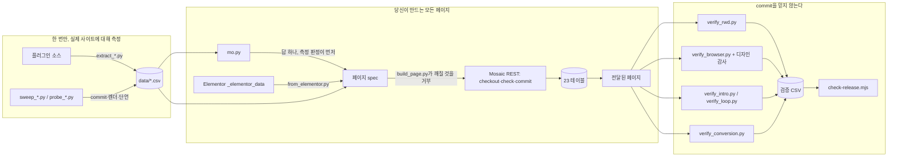

# mosaic-headless

[](https://www.npmjs.com/package/mosaic-headless)

[Mosaic Pro](https://mosaicbuilder.com)(Nextend) 사이트를 데이터 모델에 직접 써서
구축하고 수정한다 — 비주얼 에디터도, DOM도 쓰지 않는다. Elementor 페이지를 들여온다.
테마를 통째로 다른 설치로 옮긴다. 모든 주장은 실제 사이트에서 측정했다.

*다른 언어: [English](README.md) · [繁體中文](README.zh-TW.md) · [日本語](README.ja.md)*

---

## 설치

```bash
npx mosaic-headless                          # 대화형: 플랫폼 선택
npx mosaic-headless claude-code --global     # Claude Code, ~/.claude/skills/ 에
npx mosaic-headless cursor --to ./my-project
npx mosaic-headless --list                   # 지원하는 8개 플랫폼
```

| 플랫폼 | 무엇이 설치되나 | 어디에 |
|---|---|---|
| Claude Code | 스킬 전체: SKILL.md + references/ + tools/ + data/ + sites/ | `~/.claude/skills/` 또는 `./.claude/skills/` |
| Codex CLI | 스킬 전체 | `~/.codex/` |
| Gemini CLI | 스킬 전체 | `~/.gemini/` |
| GitHub Copilot | 스킬 전체, 그리고 `copilot-instructions.md`에 섹션 추가 | `./.github/` |
| Cursor | references를 내장한 `.mdc` 규칙 파일 하나 | `~/.cursor/rules/` |
| Windsurf | references를 내장한 규칙 파일 하나 | `./.devin/` |
| Continue | references를 내장한 규칙 파일 하나 | `~/.continue/` |
| Claude.ai | 프로젝트 스킬로 업로드할 zip | 저장한 곳 |

모든 플랫폼 설치는 릴리스 게이트가 템플릿에 대해 검증한다. 도구 실행에는 Python 3와
Playwright가 필요하다; 규칙 파일 플랫폼은 지식만 받고 도구는 받지 않는다.

**업데이트는 저절로 되지 않는다.** npm에 새 버전이 올라가도 에이전트가 읽는 폴더는 그대로다.
인스톨러를 `--force`와 함께 다시 실행할 것(없으면 손댔을지 모르는 SKILL.md 덮어쓰기를 거부한다):

```bash
npx mosaic-headless@latest claude-code --global --force
```


## 이것은 무엇인가

Mosaic은 페이지를 **23개의 커스텀 테이블**에 보관한다. `post_content`도 아니고 `postmeta`도
아니다. 요소 하나당 한 행, 트리 구조는 `parentID` 컬럼, 형제 순서는 fractional-index 문자열이다.
에디터는 이 모델의 한 클라이언트일 뿐이다. 포맷 자체가 아니고, 없어도 된다.

이 스킬은 그 모델의 지도 — 소스를 읽어 얻은 것이 아니라 실제 설치에 대해 측정한 것 — 에,
모델을 통해 쓰고, 나온 것을 검증하고, Elementor에서 페이지를 들여오는 도구를 더한 것이다.

## 부품이 맞물리는 방식



왼쪽에서 오른쪽으로: 표는 한 번만 측정해 동봉한다; 모든 페이지는 표를 통해 쓰이고 표가
아니라고 하면 거부된다; 전달된 페이지를 읽어 되돌리고 그 결과가 릴리스 게이트가 검사하는
표에 기록되기 전까지는 아무것도 믿지 않는다.

## 단 하나의 규칙

**노드 타입, 프로퍼티 이름, 열거값, 스타일 키, Free/Pro 판단을 기억으로 쓰지 말 것.
`data/`에서 찾을 것.**

그리고 grep이 아니라 `mo.py`로 찾을 것. grep은 입력한 질문에 답할 뿐, 실제로 품고 있는 질문에는
답하지 않는다. `accordion-content`를 grep하면 그 타입이 존재한다는 것은 알 수 있다. 스윕 표는
BROKE_PAGE라고 말한다 — 하나 배치하면 공개 페이지 전체가 54바이트 에러 문자열이 된다. 둘 다
사실이고, 둘 다 틀린 답이다. 행 옆의 메모는 그 문자열이 "부모가 없다"를 지목한다는 것,
`accordion > accordion-item` 아래에 중첩하면 commit도 렌더링도 되고 키보드로 조작 가능한
펼침 UI까지 따라온다는 것을 말한다. `mo.py type`은 그 셋을 한 번에 보여준다.

```bash
python tools/mo.py type accordion-content   # 타입 하나를 모든 라이브 스윕과 연결해 출력
python tools/mo.py check div text button    # 안전하지 않거나 모르는 타입이면 1로 종료
python tools/mo.py params text              # 타입 하나에 설정 가능한 전부
python tools/mo.py style --grouped          # 단독으로 설정하면 무효인 20개
python tools/mo.py states --verified        # 컴파일됨이 측정된 상태들
python tools/mo.py css grid-column          # 이 CSS를 내는 Mosaic 키
```

그다음 페이지를 본다. Mosaic에는 **여덟 가지** 실패 모드가 있고, HTTP 상태 코드가 바뀌는 것은
그중 셋뿐이다:

```
검증기의 정상적 거부         HTTP 200 + 본문에 `exceptions` 배열
commit 중 PHP fatal          HTTP 500 (122개 타입 중 15개가 plain div 아래에서 이렇게 됨)
구조적으로 잘못된 노드       HTTP 200, commit됨, DB에 행 있음, 그리고 공개 페이지 전체가
                             54바이트 에러 문자열이 됨
값의 "형태"가 틀림           HTTP 200, 저장됨, CSS 규칙이 그냥 안 나옴
규칙은 맞고 결과가 틀림      HTTP 200, 스타일시트에 있고, 맞고, 브라우저가 다른 값을 계산함
URL에 템플릿 없음            HTTP 406, 비로그인에게는 빈 본문
내용으로 인한 렌더 시 fatal  HTTP 500 — commit은 통과했고, Mosaic이 페이지를 파싱할 때 죽는다.
                             `code` 노드의 내용은 템플릿이라, minifier가 쓰는 `@media(`는
                             함수 호출로 읽힌다. `@media (`는 렌더링된다. build_page는
                             전자를 거부한다.
플러그인 업그레이드가 출력을 바꿈 HTTP 200, 페이지 멀쩡, 행도 이관됨 — 그런데 출력 클래스를 겨냥해
                             쓴 CSS가 아무것에도 안 맞는다. 1.0.8은 `M_EL4 M_EL_Div`를
                             `m-div _e`로, 상태 클래스도 함께, `customStyles`를
                             `customDeclarations`로 바꿨다. 예제의 탭 확대가 안 열리게 됐고,
                             그걸 말해준 건 verify_loop.py였다.
```

commit 성공은 페이지가 동작한다는 증거가 아니고, 올바른 스타일시트도 마찬가지다. 여기의 모든
도구는 쓴 뒤 페이지를 가져오며, 5xx를 빈 페이지로 취급한다 — WordPress의 "치명적 오류" 화면은
2,697바이트로, 어떤 순진한 "정상 페이지" 하한보다 크기 때문이다.

## 무엇을, 어떻게 검증했나

전부 실제 설치에서 실행 — WordPress 7.1, WooCommerce 11.1, Mosaic Pro 1.0.8, **라이선스 없음**:
라이선스가 막는 것은 테마 라이브러리와 업데이트지 노드 팩토리가 아니라서 Pro 타입도 등록되고
렌더링된다.

| 항목 | 결과 |
|---|---|
| **노드 타입** | 122 / 122를 문서당 하나씩 스윕, commit → 렌더 → 단언 → 삭제: 70 RENDERED, 25 COMMITTED, 15 COMMIT_5xx, 12 BROKE_PAGE. 1.0.8에서 재스윕: 전에는 조용히 commit되던 5개 타입이 부모 없이는 페이지를 죽인다. 렌더되지 않은 행 중 셋은 "필요한 부모 없이 commit"한 스윕 방식의 산물이며, 그 사실이 행 옆에 적혀 있다 |
| **스타일 프로퍼티** | 98 / 98을 실제 페이지에 쓰고 컴파일된 CSS와 대조: 58 COMPILED, 18 ABSENT, 21 SKIPPED |
| **노드 프로퍼티** | 182 / 182을 각 프로퍼티 자신의 검증기 체인에서 도출한 값으로 재탐사: 35 APPLIED, 43 NO_EFFECT, 55 NO_HOST, 47 SKIPPED |
| **반응형** | 두 사이트 합쳐 731개의 `_t`/`_m` 선언을, 사이트가 실제로 내보낸 스타일시트에 대해 하나씩 단언 — 전부 검증됨 |
| **브라우저** | 전달된 두 페이지를 Chromium의 세 가지 뷰포트에서 계산 스타일 3,988건 판독: 2,929건 일치, 912건은 비교 불가로 명시, **덮어쓰기 0건** |
| **디자인 감사** | 명암비, 폰트 폴백, CJK 자간, 가로 넘침, 텍스트 잘림, 한 줄 글자 수 — 브라우저에서 실행, **지적 26건, 모두 서면으로 판정** — 이유 없는 승인은 릴리스 게이트가 거부한다 |
| **컴포넌트** | 컴포넌트 시스템을 끝에서 끝까지 구동, **8건 중 8건**: 카테고리 아래 생성, 문서 자가 치유, 쓰기 가능 인스턴스로 트리 채움, 읽기 전용 인스턴스는 같은 쓰기를 거부(네거티브 컨트롤), 페이지의 두 인스턴스가 하나의 정의를 두 번 렌더 |
| **스타일 상태** | 53개 상태 중 52개를 실제 페이지에 쓰고 표가 약속한 셀렉터와 대조: **36개 정확히 일치**, 13 NO_HOST, 3 SKIPPED, 0 BROKE_PAGE. 의사 클래스는 대문자로 출력된다(`.M_EL9:HOVER`) |
| **인터랙션** | JS 애니메이션 경로를 네거티브 컨트롤과 함께 탐사하고 행을 읽어 되돌림: `propertyMetas`**는** 수락·저장된다; 프로퍼티 값은 여전히 바인딩되지 않으며, 그 경계는 이제 정확하다 |
| **아코디언** | `accordion-item`과 `accordion-content`는 스윕 표에서 BROKE_PAGE. 팩토리가 요구하는 대로 중첩하면 commit과 렌더링이 되며, **7건 중 7건** |
| **인트로 애니메이션** | 단조 시계로 15개 시점을 샘플링해 8가지를 단언. 문서의 첫 레이아웃을 기다린 뒤 시작하므로, 애니메이션이 전혀 없는 페이지 대비 늦은 프레임은 하나뿐 |
| **상시 애니메이션** | 구석에서 계속 자기를 찍어내고 탭하면 확대되는 판 — **28개 검사**: 일시정지한 타임라인을 스크럽해 주기성 증명, 다섯 폭 × 스물다섯 스크롤 지점에서 텍스트*와* 컨트롤의 가림을 "결코 읽을 수 없음"을 실패 조건으로 측정, 포인터와 Enter 양쪽으로 열림, reduced motion에서는 정지 |
| **Elementor 변환** | 운영 사이트의 모든 Elementor 페이지 — 19페이지, 3,292 요소 — 를 변환·구축하고 원본과 대조: **19건 중 19건**, 3,281 요소 이전, 11 요소 명시적 제외. 이어 변환된 페이지를 반응형·브라우저·감사에 통과시키고 모든 지적을 "상속"과 "도입"으로 분류: **도입 0건** |
| **테마 내보내기/가져오기** | 두 경로, 모두 왕복 검증. `theme_export.php`는 WP-CLI로 행을 JSON으로 옮기며 id는 그대로. `theme_zip.py`는 Mosaic **자체**의 ZIP 내보내기/가져오기를 구동 — 가져오기는 `--activate`가 없으면 테스트 모드에 놓이는데, 기본값이 라이브 사이트 전환이기 때문이다 — **22개 검사**로 사본을 원본과 트리 단위로 대조 |
| **스킬 자체** | `claude plugin eval .` — 사용자가 실제로 묻는 5문항을 각 3회, 스킬 있음/없음 두 팔로, 매회 LLM 심사 3명. **있음: 5문항 모두 1.00. 없음: 5문항 모두 0.00.** 베이스라인의 최선은 답변 거부였다 |
| **라이브 측정** | REST 라우트 114, variant 152, 조건 subject 59, 23 테이블 / 210 컬럼 |
| **라이브 업그레이드** | 1.0.7 → 1.0.8을 플러그인 자체 milestone 라우트로 wp-admin 밖에서 구동: 6 milestone, 테이블 4개 이름 변경, 출력 클래스 이름 전부 변경, `customStyles` 전부 재작성 — 그 결과 위에서 위의 측정을 전부 다시 실행 |

`SKIPPED`, `NO_HOST`, `INCONCLUSIVE`는 결코 합격률에 섞지 않는다. 자기 사각지대를 성공으로
세는 스윕이야말로 이 스킬이 반대하는 것이다.

## 조회 한 번의 비용

Mosaic 노드 타입이나 스타일 키가 실제로 무엇을 받는지 에이전트가 알아내는 방법은 셋. 같은
여섯 과제를 tiktoken으로 측정(`tools/benchmark_tokens.py`, 직접 실행 가능):

| 과제 | 소스 읽기 | 전체 표 로드 | `mo.py` 조회 |
|---|---:|---:|---:|
| 제목, 문단, 링크 버튼 배치 | 10,005 | 259,539 | **961** |
| padding, 테두리, 둥근 모서리를 반응형으로 | 3,490 | 259,539 | **396** |
| 아코디언이 쓸 만한지, 어떻게 중첩하는지 | 15,615 | 259,539 | **397** |
| 실제로 컴파일되는 hover/focus 상태 찾기 | 3,619 | 259,539 | **1,054** |
| 어떤 CSS를 내는 Mosaic 키 찾기 | 1,862 | 259,539 | **51** |
| commit 전에 무엇이 위험한지 알기 | 63,172 | 259,539 | **288** |

**소스 읽기보다 71–99.5%, 전체 표 로드보다 99.6% 이상 적은 토큰** — 게다가 여섯 중 넷은
소스로는 애초에 답할 수 없다. "선언됨"과 "컴파일됨"은 다른 질문이고, 후자를 물은 것은
스윕뿐이다. 표는 합쳐서 259,539 토큰; 절대 통째로 로드하지 말 것. `mo.py`가 쿼리다.

### 쓰기 전에 알아둘 결과

**`group`에 속한 프로퍼티는 단독으로 설정하면 무효다.** 양방향 모두 정확: 그룹 밖 78개는
58 COMPILED·0 ABSENT, 그룹 안 20개는 모두 0 COMPILED. `borderLeftWidth`, `outlineColor`,
`gridColumnStart`는 한 규칙의 세 사례다. 그룹 형태 — `border`는 `{width, style, color}` — 나
`customDeclarations`를 쓸 것.

**브레이크포인트 오버라이드는 프로퍼티를 "바꿀" 수는 있어도 "지울" 수는 없다.** 좁은 화면의
`customDeclarations`가 테두리를 그저 언급하지 않으면, 넓은 화면의 테두리는 그대로 서 있다.
`border-left:0`을 소리 내어 말할 것.

**`url`을 받는 타입은 넷뿐**: `button`, `menu-link`, `wysiwyg-link`, `dropdown-toggle`.
`text`나 `image`에 두면 수락되고, 저장되고, 앵커는 전혀 나오지 않는다. 대신 `menu-link`로
감쌀 것 — 어떤 자식이든 받고, `url`이 있으면 진짜 `<a href>`가 된다.

**이미지의 attachment protocol 경로는 uploads 디렉터리 기준 상대 경로다.**
`wp-attachment://image/<id>/full/2026/09/pic.png`는 해석되고 첨부의 가로·세로도 붙는다.
전체 경로 `wp-content/uploads/...`를 주면 — 가장 자연스러운 추측이지만 — Mosaic이 uploads
베이스를 한 번 더 앞에 붙이고, 에러도 내지 않는다.

## Elementor → Mosaic

```bash
wp post meta get 2360 _elementor_data > page.json
python tools/from_elementor.py --data page.json --out spec.json --report conv.csv \
    --uploads-base https://site/wp-content/uploads --slug works --post 208
python tools/build_site.py --config c.json --site spec.json
python tools/verify_conversion.py --data page.json --url https://site/works/ --report conv.csv
```

범위는 취향이 아니라 세어서 정했다: 실제 사이트 19페이지에서 container / heading /
text-editor / button / html / icon-list / divider / image가 전체 요소의 99.6%다. 롱테일 —
loop grid, 폼, 카운트다운, 서드파티 addon — 은 동적이라 될 노드가 없다. 각각 이름과 이유와
함께 보고되며 조용히 버려지지 않고, `--strict`는 손실 있는 spec 출력을 거부한다.

레이아웃, 타이포그래피, 색, 테두리, 링크, 이미지가 세 브레이크포인트 모두에서 넘어간다
(`_tablet`/`_mobile` → `_t`/`_m`). 넘어가지 않는 것: 진입 애니메이션(Mosaic의 인터랙션
바인딩은 미해결), shape divider, 그라데이션 오버레이. 검증기는 구축된 페이지를 원본과
대조하며 — 모든 문자열, 이미지, 링크, 제목 레벨 — 첫 회부터 제 몫을 했다: `url`을 무시하는
노드에 써서 21개 링크 중 19개를 잃던 변환기를 잡아냈다.

## 도구

| 도구 | 역할 |
|---|---|
| `mo.py` | 측정된 표면을 조회 — **정문** |
| `build_page.py` / `build_site.py` | 가드된 쓰기 경로로 spec을 commit; 깨진다고 측정된 것은 거부 |
| `from_elementor.py` / `verify_conversion.py` | Elementor → Mosaic, 그리고 내용이 도착했다는 증명 |
| `verify_browser.py` | 브라우저가 스타일시트의 약속대로 계산했는지, 디자인 감사를 통과하는지 |
| `verify_rwd.py` | 모든 `_t`/`_m` 선언이 전달된 스타일시트에 도달하는지 |
| `verify_intro.py` / `verify_loop.py` | "끝나는" 로드 애니메이션; 루프하고, 아무것도 가리지 않고, 열리는 상시 애니메이션 |
| `theme_export.php` / `theme_import.php` | 테마 전체를 JSON 행으로 WP-CLI를 통해 이동, id 그대로 |
| `theme_zip.py` / `theme_zip_compare.php` / `theme_delete.php` | Mosaic 자체 ZIP 내보내기/가져오기를 에디터 밖에서 구동, 사본을 원본과 트리 단위로 대조, 라이브 테마를 거부하는 깨끗한 삭제 |
| `data_upgrade.py` | 플러그인 업데이트 후 Mosaic의 데이터 이관을 자체 milestone 라우트로 실행 — 끝나기 전까지 에디터 API는 존재하지 않는다 |
| `sweep_*.py` / `probe_*.py` | 표를 만든 계측기 그 자체 |
| `bootstrap_probe_theme.php` / `mint_session.php` | 라이선스 없는 실험용 테마와 WP-CLI에서 만드는 REST 세션 |

## 실제 예제

`sites/_moksa.py`는 테이블만으로 진짜 스튜디오 사이트를 구축하며 참조 구현으로 동봉된다:
1,286 노드의 홈페이지에 이름 있는 view timeline으로 스크롤을 추적하는 조항 인덱스; 우키요에
판을 한 장씩 찍어내는 진입 시퀀스; 구석에서 영원히 찍어내고 탭하면 확대되는 판; 그리고 UI
전체가 shortcode를 실행하는 하나의 `code` 노드로 들어오는 WooCommerce My Account 페이지.
자체 JavaScript는 어디에도 없다. `data/`의 모든 검증 표는 이것에 대해 만들어졌다.

## 어디서 시작할까

1. `references/data-model.md` — 페이지가 실제로 사는 곳.
2. `references/write-protocol.md` — checkout / check / commit.
3. `references/failure-modes.md` — Mosaic이 실패하는 방식, 측정판. **쓰기 전에 읽을 것.**
4. `references/responsive.md` — 상태/브레이크포인트/프로퍼티 축.
5. `references/styling.md` — 스타일 값이 CSS가 되기까지.
6. `references/design-system.md` — variant(element class)와 디자인 토큰.

## 릴리스

```bash
npm version minor      # package.json, SKILL.md, 8개 플랫폼 템플릿의 버전을 올리고
                       # commit, tag, push; tag가 release.yml을 트리거
```

`bin/check-release.mjs`가 모든 릴리스를 지킨다. 검사하는 것은 "검사하기 쉬운 것"이 아니라
"틀리기 쉬운 것": 버전 번호 일치, `files`의 각 glob이 무언가와 매칭, 각 검증 CSV의 행 수가
SKILL.md와 네 README가 인용하는 수와 같음, 판정되지 않은 디자인 감사 지적 없음, eval 스위트
존재, 그리고 **tarball 자체 검사** — npm의 `files` 허용 목록은 `.gitignore`를 덮어쓰며, 한때
실제 고객의 사이트를 게시 직전의 패키지에 넣을 뻔했다.

게시는 npm trusted publishing(OIDC)으로: 토큰은 어디에도 없다. npmjs.com 패키지 설정의
Trusted Publisher: GitHub Actions, `Moksa1123` / `mosaic-headless`, workflow `release.yml`,
environment는 **비움**.

## 라이선스

MIT. Mosaic Pro 자체는 라이선스된 서드파티 소프트웨어이며 여기에 **포함되지 않는다**.
