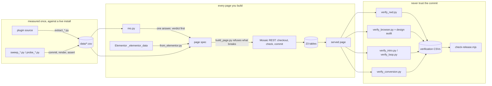

# mosaic-headless

[](https://www.npmjs.com/package/mosaic-headless)

Build and modify [Mosaic Pro](https://mosaicbuilder.com) (Nextend) sites by writing
the data model directly — no visual editor, no DOM. Convert Elementor pages into it.
Move whole themes between installs. Every claim measured on a live site.

*Read this in [繁體中文](README.zh-TW.md) · [日本語](README.ja.md) · [한국어](README.ko.md)*

---

## Install

```bash
npx mosaic-headless                          # interactive: pick a platform
npx mosaic-headless claude-code --global     # Claude Code, into ~/.claude/skills/
npx mosaic-headless cursor --to ./my-project
npx mosaic-headless --list                   # all eight platforms
```

| platform | what is installed | where |
|---|---|---|
| Claude Code | full skill: SKILL.md + references/ + tools/ + data/ + sites/ | `~/.claude/skills/` or `./.claude/skills/` |
| Codex CLI | full skill | `~/.codex/` |
| Gemini CLI | full skill | `~/.gemini/` |
| GitHub Copilot | full skill, plus a section appended to `copilot-instructions.md` | `./.github/` |
| Cursor | one `.mdc` rule with the references embedded | `~/.cursor/rules/` |
| Windsurf | one rule file with the references embedded | `./.devin/` |
| Continue | one rule file with the references embedded | `~/.continue/` |
| Claude.ai | a zip to upload as a project skill | wherever you save it |

Every platform install is verified by the release gate against its template. The
tools need Python 3 and Playwright to run; the rule-file platforms get the knowledge
without the tools.

**Updating does not happen on its own.** A new version on npm changes nothing in
the folder your agent loads; re-run the installer with `--force` (without it, it
refuses to overwrite a SKILL.md you may have edited):

```bash
npx mosaic-headless@latest claude-code --global --force
```


## What this is

Mosaic keeps a page in **23 custom database tables**, not in `post_content` and not
in `postmeta`. One row per element, the tree carried by a `parentID` column, sibling
order by a fractional-index string. The editor is one client of that model. It is not
the format, and you do not need it.

This skill is the map of that model — measured against a live install rather than
read off the source — plus the tools to write through it, check what came out, and
bring pages in from Elementor.

## How the pieces fit



Left to right: the tables are measured once and shipped; every page is written
through them and refused when they say no; and nothing is believed until the
delivered page has been read back and the result recorded in a table that the
release gate checks.

## The one rule

**Never write a node type, property name, enum value, style key or Free/Pro claim
from memory. Look it up in `data/`.**

And look it up with `mo.py`, not grep. Grep answers the question you typed; it does
not answer the question you have. Ask grep about `accordion-content` and it confirms
the type exists. The sweep says BROKE_PAGE: place one and the whole public page
becomes a 54-byte error string. Both true, both the wrong answer — the note beside
the row says that string names a missing parent, and that nested under
`accordion > accordion-item` the type commits, renders, and hands you a
keyboard-operable disclosure. `mo.py type` shows all three at once.

```bash
python tools/mo.py type accordion-content   # one type, joined to every live sweep
python tools/mo.py check div text button    # exits 1 on an unsafe or unknown type
python tools/mo.py params text              # everything settable on one type
python tools/mo.py style --grouped          # the 20 that are inert set on their own
python tools/mo.py states --verified        # the states measured to compile
python tools/mo.py css grid-column          # which Mosaic key drives this CSS
```

Then check the page. Mosaic has **eight** failure modes and only three of them change
the HTTP status code:

```
clean validator rejection   HTTP 200  + an `exceptions` array in the body
PHP fatal during commit     HTTP 500  (15 of 122 types do this from a plain div)
structurally invalid node   HTTP 200, committed, row in the DB, and the whole
                            public page becomes a 54-byte error string
wrong value SHAPE           HTTP 200, stored, and the CSS rule is simply absent
right rule, wrong result    HTTP 200, in the stylesheet, correct, and the BROWSER
                            computes something else
no template for the URL     HTTP 406 with an EMPTY BODY for anyone not logged in
render-time fatal from      HTTP 500 - the commit went through, the page dies when
CONTENT                     Mosaic parses it. A `code` node's content is a template:
                            `@media(` as every minifier writes it is read as a
                            function call. `@media (` renders. build_page refuses
                            the former.
plugin upgrade renamed      HTTP 200, page intact, rows migrated - and CSS you wrote
what the page emits         against an emitted class matches nothing. 1.0.8 turned
                            `M_EL4 M_EL_Div` into `m-div _e`, state classes with it,
                            `customStyles` into `customDeclarations`. The example's
                            tap-to-enlarge stopped opening; verify_loop.py said so.
```

A successful commit is not evidence of a working page, and neither is a correct
stylesheet. Every tool here fetches the page afterwards — and treats a 5xx as an
empty page, because WordPress's "critical error" screen is 2,697 bytes and larger
than any naive healthy-page floor.

## What was verified, and how

Everything ran against a live install — WordPress 7.1, WooCommerce 11.1, Mosaic Pro
1.0.8, **unlicensed**: the licence gates the theme library and updates, not the node
factories, so Pro types register and render regardless.

| pass | result |
|---|---|
| **node types** | 122 / 122 swept one per document, committed → rendered → asserted → deleted: 70 RENDERED, 25 COMMITTED, 15 COMMIT_5xx, 12 BROKE_PAGE. Re-swept on 1.0.8: five types that used to commit silently now kill the page unparented. The non-rendering rows that are artefacts of committing without the required parent say so beside the row |
| **style properties** | 98 / 98 written to a live page and checked against the compiled CSS: 58 COMPILED, 18 ABSENT, 21 SKIPPED |
| **node properties** | 182 / 182 re-probed with a value shaped by each property's own validator chain: 35 APPLIED, 43 NO_EFFECT, 55 NO_HOST, 47 SKIPPED |
| **responsive** | 731 `_t`/`_m` declarations across two sites asserted against the stylesheet the site actually served — all verified |
| **browser** | 3,988 computed-style readings on two delivered pages in Chromium at three viewports: 2,929 compared and agreed, 912 not-comparable and labelled, **0 overridden** |
| **design audit** | contrast, font fallback, CJK tracking, overflow, clipped text, line measure — run in the browser, **26 findings, every one ruled on in writing** — an acknowledgement without a reason is refused by the release gate |
| **components** | the component system driven end to end, **8 of 8**: created under a category, document healed, tree filled through the writable instance, the read-only one refused the same write as a negative control, two instances on a page rendering one definition twice |
| **style states** | 52 of the 53 states written to a live page and matched against the selector the table promises: **36 compiled exactly**, 13 NO_HOST, 3 SKIPPED, 0 BROKE_PAGE. Pseudo-classes are emitted UPPERCASE (`.M_EL9:HOVER`) |
| **interactions** | the JS animation path probed with negative controls and the row read back: `propertyMetas` **is** accepted and stored; the property values still do not bind, and the boundary is now exact |
| **accordion** | `accordion-item` and `accordion-content` sit in the sweep table as BROKE_PAGE; nested as their factory requires they commit and render, **7 of 7** |
| **entrance animation** | the page-load sequence sampled at fifteen timestamps on a monotonic clock and asserted on eight counts. Costs one late frame over a page with no animation at all, because it waits for the document's first layout |
| **perpetual animation** | a corner plate that keeps printing itself and opens to full size when tapped, **28 checks**: periodicity by scrubbing a paused timeline, occlusion of text *and* controls at five widths and twenty-five scroll stops with "never readable" as the failing condition, opened by pointer and by Enter, still under reduced motion |
| **Elementor conversion** | every Elementor page of a production site — 19 pages, 3,292 elements — converted, built and checked against its source: **19 of 19**, 3,281 elements carried, 11 declared. Then the converted page through rwd, browser and the audit, with every finding classified inherited-or-introduced: **0 introduced** |
| **theme export/import** | two paths, both round-tripped. `theme_export.php` moves rows as JSON over WP-CLI, ids intact. `theme_zip.py` drives Mosaic's **own** ZIP export/import — import lands in test mode unless told `--activate`, because the default is to switch the live site — and **22 checks** hold the copy against the source tree for tree |
| **the skill itself** | `claude plugin eval .` — five cases a user would ask, three runs each, with and without the skill loaded, three LLM judges a run. **With: 1.00 on all five. Without: 0.00 on all five.** The baseline's best answer was to refuse |
| **measured live** | 114 REST routes, 152 variants, 59 condition subjects, 23 tables / 210 columns |
| **custom fields** | ACF and Meta Box, forty fields on a page, read back through `@VAR` / `@LOOP` off the delivered HTML: 59 of 62 resolve, 3 empties explained; loops over multi-value fields rendered exactly the field's rows. `tools/list_fields.php` prints the names Mosaic actually registers |
| **upgraded live** | 1.0.7 -> 1.0.8 over the plugin's own milestone route, from outside wp-admin: 6 milestones, four tables renamed, every emitted class name changed, every `customStyles` rewritten - then every sweep above re-run on the result |

`SKIPPED`, `NO_HOST` and `INCONCLUSIVE` are never folded into a pass rate. A sweep
that scores its own blind spots as successes is the thing this skill argues against.

## What it costs to consult

Three ways an agent can learn what a Mosaic node type or style key actually takes,
priced on the same six tasks with tiktoken (`tools/benchmark_tokens.py`; run it
yourself):

| task | read the source | load every table | `mo.py` query |
|---|---:|---:|---:|
| place a heading, a paragraph and a linked button | 10,005 | 259,539 | **961** |
| set padding, a border and a radius, responsively | 3,490 | 259,539 | **396** |
| decide whether the accordion is usable, and how to nest it | 15,615 | 259,539 | **397** |
| find which hover/focus states actually compile | 3,619 | 259,539 | **1,054** |
| find which Mosaic key drives one CSS property | 1,862 | 259,539 | **51** |
| know what is unsafe before committing anything | 63,172 | 259,539 | **288** |

**71–99.5% fewer tokens than reading the source, 99.6%+ fewer than loading the
tables** — and the source could not have answered four of the six at all, because
"declared" and "compiles" are different questions and only the sweeps asked the
second one. The tables total 259,539 tokens; never load them. `mo.py` is the query.

### Results worth knowing before you write anything

**A property that belongs to a `group` is inert when set on its own.** Exact in both
directions: 78 ungrouped properties gave 58 COMPILED and 0 ABSENT; all 20 grouped
ones gave 0 COMPILED. So `borderLeftWidth`, `outlineColor` and `gridColumnStart` are
three instances of one rule, not three oddities. Use the grouped shape — `border`
takes `{width, style, color}` — or `customDeclarations`.

**A breakpoint override can CHANGE a property but never REMOVE one.** Narrow-screen
`customDeclarations` that merely omits a border leaves the wide-screen border standing.
Say `border-left:0` out loud.

**Only four types take a `url`**: `button`, `menu-link`, `wysiwyg-link`,
`dropdown-toggle`. On a `text` or an `image` it is accepted, stored, and emits no
anchor. Wrap the thing in a `menu-link` instead — it takes any children and becomes
a real `<a href>`.

**An image's attachment-protocol path is relative to the uploads directory.**
`wp-attachment://image/<id>/full/2026/09/pic.png` resolves and carries the
attachment's width and height. Give it the full `wp-content/uploads/...` path — the
obvious guess — and Mosaic prefixes the uploads base a second time, silently.

## Elementor → Mosaic

```bash
wp post meta get 2360 _elementor_data > page.json
python tools/from_elementor.py --data page.json --out spec.json --report conv.csv \
    --uploads-base https://site/wp-content/uploads --slug works --post 208
python tools/build_site.py --config c.json --site spec.json
python tools/verify_conversion.py --data page.json --url https://site/works/ --report conv.csv
```

Scope was decided by counting, not by taste: across a real site's 19 pages,
container / heading / text-editor / button / html / icon-list / divider / image are
99.6% of every element present. The long tail — loop grids, forms, countdowns,
third-party addons — is dynamic and has no node to become; each is reported by
name and reason, never dropped, and `--strict` refuses to write a lossy spec.

Layout, typography, colour, borders, links and images cross over, at all three
breakpoints (`_tablet`/`_mobile` → `_t`/`_m`). What does not: entrance animations
(Mosaic's interaction binding is unsolved), shape dividers, gradient overlays. The
verifier then holds the built page against the source — every string, image, link
and heading level — and it earned its place at once: it caught the converter losing
19 of 21 links by writing `url` onto nodes that ignore it.

## Tools

| tool | does |
|---|---|
| `mo.py` | query the measured surface — **the front door** |
| `build_page.py` / `build_site.py` | commit a spec through the guarded write path; refuses what is measured to break |
| `from_elementor.py` / `verify_conversion.py` | Elementor → Mosaic, and proof the content arrived |
| `verify_browser.py` | does the browser compute what the stylesheet promised, and does it pass a design audit |
| `verify_rwd.py` | does every `_t`/`_m` declaration reach the served stylesheet |
| `verify_intro.py` / `verify_loop.py` | a page-load sequence that ENDS; a perpetual one that loops, hides nothing, and opens |
| `theme_export.php` / `theme_import.php` | a whole theme as JSON rows over WP-CLI, ids intact |
| `theme_zip.py` / `theme_zip_compare.php` / `theme_delete.php` | Mosaic's own ZIP export/import from outside the editor, the copy held against the source, and a clean delete that refuses the live theme |
| `list_fields.php` | every `@VAR` / `@LOOP` name a post's custom fields register, with values |
| `data_upgrade.py` | after a plugin update, Mosaic's data migration over its own milestone route - the editor API is gone until it runs |
| `sweep_*.py` / `probe_*.py` | the instruments the tables were made with |
| `bootstrap_probe_theme.php` / `mint_session.php` | a licence-free scratch theme and a REST session from WP-CLI |

## The worked example

`sites/_moksa.py` builds a real studio site through the tables alone and ships as
the reference: a homepage of 1,286 nodes with a scroll-tracking clause index on named
view timelines, an entrance sequence that prints an ukiyo-e sheet one carved block
at a time, a corner plate that keeps printing forever and opens when tapped, and a
WooCommerce My Account page whose UI arrives through one `code` node running a
shortcode. No JavaScript of its own anywhere. Every verification table in `data/`
was produced against it.

## Where to start

1. `references/data-model.md` — where a page actually lives.
2. `references/write-protocol.md` — checkout / check / commit.
3. `references/failure-modes.md` — how Mosaic fails, measured. **Read before writing.**
4. `references/responsive.md` — the state/breakpoint/property axis.
5. `references/styling.md` — how a style value becomes CSS.
6. `references/design-system.md` — variants (element classes) and design tokens.

## Releasing

```bash
npm version minor      # bumps package.json, SKILL.md and eight platform templates,
                       # commits, tags, pushes; the tag triggers release.yml
```

`bin/check-release.mjs` gates every release on the things that are easy to get
wrong: the version numbers agree, every `files` glob matches, every verification
CSV still has the row count SKILL.md and the four READMEs quote, no design-audit
finding is unreviewed, the eval suite is present, and **the tarball itself is
inspected** — npm's `files` allowlist overrides `.gitignore`, and once put a real
client's site into a package that was about to publish.

Publishing runs on npm trusted publishing (OIDC): no token anywhere. Setup on
npmjs.com under the package's Trusted Publisher: GitHub Actions, `Moksa1123` /
`mosaic-headless`, workflow `release.yml`, environment **empty**.

## Licence

MIT. Mosaic Pro itself is licensed third-party software and is **not** included here.
